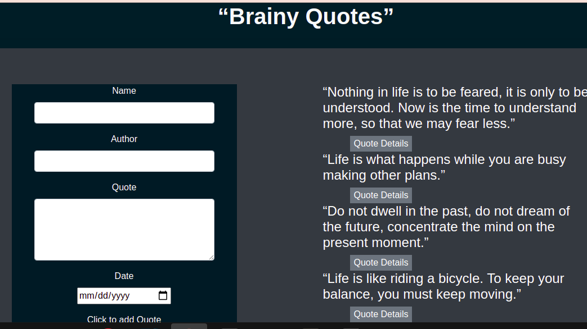

# Quotes

# Brainy Quotes

An application where users can create quotes and have those quotes voted on whether they are terrible or are inspirational

## Author

Robbin Mwangi Githimbo

## Description and Requirements

This project was generated with [Angular CLI](https://github.com/angular/angular-cli) version 12.2.7.

## Development server

Run `ng serve` for a dev server. Navigate to `http://localhost:4200/`. The app will automatically reload if you change any of the source files.
`

## Code scaffolding

Run `ng generate component component-name` to generate a new component. You can also use `ng generate directive|pipe|service|class|guard|interface|enum|module`.

### Technologies Used

1. HTML(Hypertext Mark-up Language)
2. CSS (Cascading Style Sheet)
4. Javascript
5. Bootstrap
3. Git

### Live Site
Go to  [live]( https://robbingit.github.io/Top-Pizzas/) site.

### Support
For support reach me via Email(robbingithimbo@gmail.com)

### Licence
This project is under the  [MIT](LICENSE) licence: 

Copyright (c) 2021 Robbin Mwangi Githimbo.

